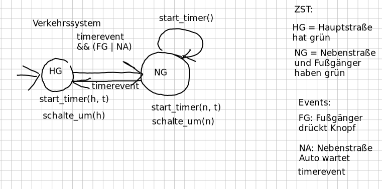

- [it4-em-ampel](#it4-em-ampel)
  - [Projektstruktur](#projektstruktur)
- [Verkehrssystem](#verkehrssystem)
    - [Pinout](#pinout)
    - [Zustände](#zustände)
- [Leitsystem](#leitsystem)
    - [Pinout](#pinout-1)
- [Anforderungen](#anforderungen)
  - [0. Anwendungs-Anforderungen Leitsystem auf der Verkehrsstrecke Regensburg-Prüfening-III](#0-anwendungs-anforderungen-leitsystem-auf-der-verkehrsstrecke-regensburg-prüfening-iii)
    - [0.1 Schaltung der Anlage an Werktagen (Mo-Fr)](#01-schaltung-der-anlage-an-werktagen-mo-fr)
    - [0.2 Schaltung der Anlage an Samstagen](#02-schaltung-der-anlage-an-samstagen)
    - [0.3 Schaltung der Anlage an Sonntagen](#03-schaltung-der-anlage-an-sonntagen)
  - [1. Technische Anforderungen Leuchtsystem der Ampelanlage](#1-technische-anforderungen-leuchtsystem-der-ampelanlage)
    - [1.1 Ausstattung Leuchtmittel](#11-ausstattung-leuchtmittel)
    - [1.2 Aufbau Leuchtanlage Hauptstraße](#12-aufbau-leuchtanlage-hauptstraße)
    - [1.3 Aufbau Leuchtanlage Nebenstraße](#13-aufbau-leuchtanlage-nebenstraße)
    - [1.4 Aufbau Leuchtanlage Fußgängerüberweg](#14-aufbau-leuchtanlage-fußgängerüberweg)
  - [2. Technische Anforderungen Benutzerschnittstelle Ampelanlage](#2-technische-anforderungen-benutzerschnittstelle-ampelanlage)
    - [2.1 Fußgänger-bewirkte Sicherung der Fußgängerquerung der Hauptstraße](#21-fußgänger-bewirkte-sicherung-der-fußgängerquerung-der-hauptstraße)
    - [2.2 Fahrzeug-bewirkte Sicherung der T-Kreuzung für Einfahrt von der Nebenstraße](#22-fahrzeug-bewirkte-sicherung-der-t-kreuzung-für-einfahrt-von-der-nebenstraße)
  - [3. Funktionale Anforderungen Bedien-Anwendung des Leitsystems](#3-funktionale-anforderungen-bedien-anwendung-des-leitsystems)
  - [4. Technische Anforderungen Schnittstellen des Leitsystems](#4-technische-anforderungen-schnittstellen-des-leitsystems)
    - [4.1 Kommunikation zwischen Ampelsystemen und Bedien-Anwendung](#41-kommunikation-zwischen-ampelsystemen-und-bedien-anwendung)
    - [4.2 Kommunikation von Ampelsystemen](#42-kommunikation-von-ampelsystemen)
    - [4.3 Signalumwandlung](#43-signalumwandlung)
  - [5. Funktionale Anforderungen Steuergerät Ampelanlage](#5-funktionale-anforderungen-steuergerät-ampelanlage)
    - [5.1 Werkseinstellung Betriebsablaufliste](#51-werkseinstellung-betriebsablaufliste)
    - [5.2 Betriebszustände – normativer Ablauf](#52-betriebszustände--normativer-ablauf)
    - [5.3 Betriebszustände – degradierter Ablauf](#53-betriebszustände--degradierter-ablauf)
    - [5.4 Verhalten im Betriebszustand „Degraded_op“](#54-verhalten-im-betriebszustand-degraded_op)
    - [5.5 Verhalten im Betriebszustand „Remote_freq_op“](#55-verhalten-im-betriebszustand-remote_freq_op)
    - [5.6 Verhalten im Betriebszustand „Low_freq_op“](#56-verhalten-im-betriebszustand-low_freq_op)
    - [5.7 Verhalten im Betriebszustand „High_freq_op“](#57-verhalten-im-betriebszustand-high_freq_op)
    - [5.8 Verhalten beim Wechsel des Betriebszustands](#58-verhalten-beim-wechsel-des-betriebszustands)
    - [5.9 Leuchtstärke rote Leuchtmittel](#59-leuchtstärke-rote-leuchtmittel)
    - [5.10 Leuchtstärke gelbe Leuchtmittel Hauptstraßenampel](#510-leuchtstärke-gelbe-leuchtmittel-hauptstraßenampel)
    - [5.11 Leuchtstärke gelbe Leuchtmittel Nebenstraßenampel](#511-leuchtstärke-gelbe-leuchtmittel-nebenstraßenampel)
    - [5.12 Leuchtstärke grüne Leuchtmittel für Haupt- und Nebenstraße](#512-leuchtstärke-grüne-leuchtmittel-für-haupt--und-nebenstraße)
    - [5.13 Verhalten bei Stromausfall/Abschaltung](#513-verhalten-bei-stromausfallabschaltung)
    - [5.14 Verhalten beim Upgrade der Firmware](#514-verhalten-beim-upgrade-der-firmware)
  - [6. Technische Anforderungen Steuergerät Ampelanlage](#6-technische-anforderungen-steuergerät-ampelanlage)
    - [6.1 Speicherbereich für dauerhaft gespeicherte Daten](#61-speicherbereich-für-dauerhaft-gespeicherte-daten)
    - [6.2 Speicherplatz für Firmware-Versionsnummer](#62-speicherplatz-für-firmware-versionsnummer)
    - [6.3 Verwendeter Mikrocontroller für Ampelsystem-Steuergerät](#63-verwendeter-mikrocontroller-für-ampelsystem-steuergerät)
    - [6.4 Treiberbaustein RS485-Bus für Ampelsystem-Steuergerät](#64-treiberbaustein-rs485-bus-für-ampelsystem-steuergerät)
    - [6.5 Modul Real-Time-Clock](#65-modul-real-time-clock)
  - [7. Technische Anforderungen Leitsystem](#7-technische-anforderungen-leitsystem)
    - [7.1 Verwendeter Mikrocontroller für Leitsystem-Steuergerät](#71-verwendeter-mikrocontroller-für-leitsystem-steuergerät)
  - [8. Technische Sicherheitsanforderungen Ampelanlage](#8-technische-sicherheitsanforderungen-ampelanlage)
    - [8.1 Überprüfung der angeschlossenen Ampelsystem](#81-überprüfung-der-angeschlossenen-ampelsystem)
    - [8.2 Fehlercodes der angeschlossenen Ampelsystem](#82-fehlercodes-der-angeschlossenen-ampelsystem)
    - [8.3 *Entfällt*](#83-entfällt)
    - [8.4 Selbsttest SRAM-Speicher](#84-selbsttest-sram-speicher)
    - [8.5 Selbsttest auf Stack-Overflow](#85-selbsttest-auf-stack-overflow)
    - [8.6 Selbsttest-Aufruf-Frequenz](#86-selbsttest-aufruf-frequenz)
    - [8.7 *Entfällt*](#87-entfällt)
    - [8.8 *Entfällt*](#88-entfällt)
    - [8.9 Überprüfung der angeschlossenen Rot-Lichter auf der Hauptstraße](#89-überprüfung-der-angeschlossenen-rot-lichter-auf-der-hauptstraße)
    - [8.10 Überprüfung der angeschlossenen Rot-Lichter auf der Nebenstraße](#810-überprüfung-der-angeschlossenen-rot-lichter-auf-der-nebenstraße)
    - [8.11 Fehler beim Einlesen des Datums/der Uhrzeit](#811-fehler-beim-einlesen-des-datumsder-uhrzeit)

# it4-em-ampel
Umsetzungen der Projektanforderungen für ein Ampelsystem auf dem Atmega328p geschrieben in C unter Verwendung der AVR Libc und der AVR-gcc toolchain. Als Umgebung wird PlatformIO in Vscode verwendet.

## Projektstruktur
* Dieses Repo enthält drei Projekte:
    * verkehrssystem
    * leitsystem
    * pc-interface

# Verkehrssystem
### Pinout
| Atmega ports | Pro micro PIN | IO        | Farben  |
| ------------ | ------------- | --------- | ------- |
| PB0          | 8             | HS grün   |         |
| PB1          | 9             | HS gelb   |         |
| PD4          | 4             | HS rot    |         |
| PD5          | 5             | NS grün   |         |
| PD6          | 6             | NS gelb   |         |
| PD7          | 7             | NS rot    |         |
| -            | -             | FG grün   |         |
| -            | -             | FG rot    |         |
| PD2 (INT0)   | 2             | FG taster |         |
| PD3 (INT1)   | 3             | NS taster |         |
| PB2          | 10            | SPI SS    | lila    |
| PB3          | 11            | SPI MOSI  | grau    |
| PB4          | 12            | SPI MISO  | weiß    |
| PB5          | 13            | SPI CLK   | schwarz |

### Zustände

# Leitsystem
### Pinout
| Atmega ports | Pro micro PIN | IO       | Farben  |
| ------------ | ------------- | -------- | ------- |
| PB2          | 10            | SPI SS   | lila    |
| PB3          | 11            | SPI MOSI | grau    |
| PB4          | 12            | SPI MISO | weiß    |
| PB5          | 13            | SPI CLK  | schwarz |
<!-- todo @Emergency1999 -->

# Anforderungen

| Anforderungen | umgesetzt  |
| ------------- | ---------- |
| 0.            | █████▒▒▒▒▒ |
| 1.            | ██████████ |
| 2.            | ██████████ |
| 3.            | ▒▒▒▒▒▒▒▒▒▒ |
| 4.            | ███████▒▒▒ |
| 5.            | ████████▒▒ |
| 6.            | ███▒▒▒▒▒▒▒ |
| 7.            | ██████████ |
| 8.            | █▒▒▒▒▒▒▒▒▒ |
|               |            |
| TOTAL         | █████▒▒▒▒▒ |

## 0. Anwendungs-Anforderungen Leitsystem auf der Verkehrsstrecke Regensburg-Prüfening-III
### 0.1 Schaltung der Anlage an Werktagen (Mo-Fr)
> leitsystem/src/main

Teilweise umgesetzt
### 0.2 Schaltung der Anlage an Samstagen
> leitsystem/src/main

Teilweise umgesetzt
### 0.3 Schaltung der Anlage an Sonntagen
> leitsystem/src/main

Teilweise umgesetzt
## 1. Technische Anforderungen Leuchtsystem der Ampelanlage
### 1.1 Ausstattung Leuchtmittel
Done.
### 1.2 Aufbau Leuchtanlage Hauptstraße
> verkehrssystem/lib/lights

Done.
### 1.3 Aufbau Leuchtanlage Nebenstraße
> verkehrssystem/lib/lights

Done.
### 1.4 Aufbau Leuchtanlage Fußgängerüberweg
> verkehrssystem/lib/lights

Done.
## 2. Technische Anforderungen Benutzerschnittstelle Ampelanlage
### 2.1 Fußgänger-bewirkte Sicherung der Fußgängerquerung der Hauptstraße
> verkehrssystem/src/main -> high_freq_op()  
> verkehrssystem/lib/lights -> ISR

Done.
### 2.2 Fahrzeug-bewirkte Sicherung der T-Kreuzung für Einfahrt von der Nebenstraße
> verkehrssystem/src/main -> high_freq_op()  
> verkehrssystem/lib/lights -> ISR

Done.
## 3. Funktionale Anforderungen Bedien-Anwendung des Leitsystems
Nicht umgesetzt.
## 4. Technische Anforderungen Schnittstellen des Leitsystems
### 4.1 Kommunikation zwischen Ampelsystemen und Bedien-Anwendung
> lib/uart

Done.
### 4.2 Kommunikation von Ampelsystemen
> verkehrssystem/lib/spi  
> leitsystem/lib/spi

* Teilweise umgesetzt
* Kommunikationsprobleme bei Versuch über SPI
### 4.3 Signalumwandlung
Nicht umgesetzt.
## 5. Funktionale Anforderungen Steuergerät Ampelanlage
### 5.1 Werkseinstellung Betriebsablaufliste
> verkehrssystem/src/main -> main()

Done.
### 5.2 Betriebszustände – normativer Ablauf
> verkehrssystem/src/main -> main()

Done.
### 5.3 Betriebszustände – degradierter Ablauf
> verkehrssystem/src/main -> main()

Done.
### 5.4 Verhalten im Betriebszustand „Degraded_op“
> verkehrssystem/src/main -> main()

Done.
### 5.5 Verhalten im Betriebszustand „Remote_freq_op“
> verkehrssystem/src/main -> remote_freq_op()

Done.
### 5.6 Verhalten im Betriebszustand „Low_freq_op“
> verkehrssystem/src/main -> low_freq_op()

Done.
### 5.7 Verhalten im Betriebszustand „High_freq_op“
> verkehrssystem/src/main -> high_freq_op()

Done.
### 5.8 Verhalten beim Wechsel des Betriebszustands
> verkehrssystem/src/main -> main()
> lib/events

Done.
### 5.9 Leuchtstärke rote Leuchtmittel
Done.
### 5.10 Leuchtstärke gelbe Leuchtmittel Hauptstraßenampel
Done.
### 5.11 Leuchtstärke gelbe Leuchtmittel Nebenstraßenampel
Nicht umgesetzt.
### 5.12 Leuchtstärke grüne Leuchtmittel für Haupt- und Nebenstraße
Nicht umgesetzt.
### 5.13 Verhalten bei Stromausfall/Abschaltung
Nicht umgesetzt.
### 5.14 Verhalten beim Upgrade der Firmware
Nicht umgesetzt.
## 6. Technische Anforderungen Steuergerät Ampelanlage
### 6.1 Speicherbereich für dauerhaft gespeicherte Daten
Nicht umgesetzt.
### 6.2 Speicherplatz für Firmware-Versionsnummer
Nicht umgesetzt.
### 6.3 Verwendeter Mikrocontroller für Ampelsystem-Steuergerät
Done.
### 6.4 Treiberbaustein RS485-Bus für Ampelsystem-Steuergerät
Ansatz mit SPI da Hardware nicht vorhanden war.
### 6.5 Modul Real-Time-Clock
Nicht umgesetzt.
## 7. Technische Anforderungen Leitsystem
### 7.1 Verwendeter Mikrocontroller für Leitsystem-Steuergerät
Done.
## 8. Technische Sicherheitsanforderungen Ampelanlage
### 8.1 Überprüfung der angeschlossenen Ampelsystem
Nicht umgesetzt wegen Kommunikationsproblemen.
### 8.2 Fehlercodes der angeschlossenen Ampelsystem
> lib/global_config -> Error codes

Done.
### 8.3 *Entfällt*
### 8.4 Selbsttest SRAM-Speicher
Nicht umgesetzt.
### 8.5 Selbsttest auf Stack-Overflow
Nicht umgesetzt.
### 8.6 Selbsttest-Aufruf-Frequenz
Nicht umgesetzt.
### 8.7 *Entfällt*
### 8.8 *Entfällt*
### 8.9 Überprüfung der angeschlossenen Rot-Lichter auf der Hauptstraße
Nicht umgesetzt.
### 8.10 Überprüfung der angeschlossenen Rot-Lichter auf der Nebenstraße
Nicht umgesetzt.
### 8.11 Fehler beim Einlesen des Datums/der Uhrzeit
Nicht umgesetzt.